# How to deploy a static website to Elastic Beanstalk for the Enterprise

In this lab we will guide you through the process of deploying a **static website** to AWS Elastic Beanstalk.

## Audience

The audience for this lab are system and software engineers with basic knowledge of **AWS**

## Executive Summary

In a few steps we show how to host your existing static website (HTML, JS, CSS, etc.) in **AWS Elastic Beanstalk** using our pre-baked deployment ZIP [1InitialDeploymentPackage.zip](1InitialDeploymentPackage.zip) as alternative to hosting a static website in **S3** with **CloudFront**, as this is not (yet) suitable for hosting private enterprise applications.

## Prerequisites 

- an active AWS account with a role that has permissions to create instances in **Elastic Beanstalk** and their associated **Security Groups**.

## Technical Concepts

### API-first development

**API-first development** is a strategy in which the first order of business is to develop an API that puts your target developer’s interests first and then build the product on top of it (be it a website, mobile application, or a SaaS software). 

By building on top of APIs with developers in mind, you and your developers are saving a lot of work while laying down the foundations for others to build on.

### Static website hosting

The trend of hosting **static websites** in the cloud is a becoming very popular. This approach has been adopted by many organizations due to its advantages over traditional server-based hosting. Static websites are websites that do not require any runtime environment like JRE, .NET, etc. and are mostly based on HTML, CSS, JS, and other static resources (audio/video files, documents, etc.) and using asynchronous HTTP calls to communicate with a back-end API. 
  
You *can* host a static website on **Amazon S3**. On a static website, individual webpages include static content. They might also contain client-side scripts. By contrast, a dynamic website relies on server-side processing, including server-side scripts such as PHP, JSP, or ASP.NET. Amazon S3 does not support server-side scripting. With static web-hosting it is relatively easy to port your application to mobile form factors using the same code base. 

However, **since S3 bucket URLs are non-SSL** (in other words: ``http://`` instead of ``https://``) and intended for internet-facing applications, they are **not suitable** to be used **for hosting private enterprise applications**. Even with the integration with a **CloudFront** instance, which would allow associating a SSL certificate to the S3 bucket, the application would still be publicly facing the internet. Therefore, it is our recommendation to **avoid S3 static website hosting** for internal facing enterprise applications and opt for the hosting of a **static website using AWS Elastic Beanstalk** as described in this lab.

### Securing your static hosted website

It is important to realize that in a static hosted API-first architecture all UI script is running in the browser and our true **first line of defense is the server-side API**. Since we are building a static hosted website with an API-first development strategy, your client-side script effectively becomes "open source" and all API-calls should require an access token. This is different from, for example a .NET application, where your UI logic partly runs on the server. 

**Note:** technically we could use an access token to secure all but a single landing page in our static web application. We will go into more depth on this in a later lab.

## Step 1. Prepare Deployment ZIP

In order to host a static website in Elastic Beanstalk, we will be deploying a **small NodeJS web server**. All this NodeJS web server will do is serve all static files from a subfolder ``/www``:

**server.js:**

	// server.js: This is a tiny NodeJS web server hosting static files from the /www folder in the Elastic Beanstalk deployment ZIP
	// Express is a minimal and flexible Node.js web application framework that provides a robust set of features for web and mobile applications.
	var express = require('express');
	// Let's create an instance of an express web server
	var app = express();
	// By default, let's use port 80, unless we provide a different value as argument or system environment variable
	var port = process.env.PORT || process.argv[2] || 80;
	// Let's host all the static files in /www as root of our little web server
	app.use('/', express.static(__dirname + '/www'));
	// Start listening on the desired port for incoming traffic
	var server = app.listen(port, function () {
	    console.log('listening on port:', port);
	});
 
By compressing this ``server.js`` file into a ZIP called [1InitialDeploymentPackage.zip](1InitialDeploymentPackage.zip) for instance along with a [1InitialDeploymentPackage/package.json](1InitialDeploymentPackage/package.json) (where all dependencies on external libraries are mentioned) and a ``www`` folder where you can put your existing static website root, we now have a deployment package that can be consumed by Elastic Beanstalk:

**1InitialDeploymentPackage.zip:**

	package-lock.json
	package.json
	server.js
	www

Take a look at the at the provided [1InitialDeploymentPackage.zip](1InitialDeploymentPackage.zip "1InitialDeploymentPackage.zip"). You can use this ZIP file for your first deployment to Elastic Beanstalk. All you have to do is copy your static web site into the ``/www`` folder of the ZIP file.

For instance, [2FirstDeploymentOfSampleWebsite.zip](2FirstDeploymentOfSampleWebsite.zip "2FirstDeploymentOfSampleWebsite.zip") contains a sample static website:

	package-lock.json
	package.json
	server.js
	www/
		index.html
		js/
			main.js

**Note:** you may also find a ``.ebextensions`` folder in the Elastic Beanstalk deployment ZIPs. This is where you can control the provisioning of your Elastic Beanstalk instance(s). You may ignore this folder for now.

Now, feel free to go ahead and replace the contents of the ``www`` folder of [2FirstDeploymentOfSampleWebsite.zip](2FirstDeploymentOfSampleWebsite.zip) with the contents of your existing static hosted website. If you do not replace the contents of the ``www`` folder you will deploy a simple HTML website with a button that will make a dummy API call``.

Even, technically this is all you need to do to prepare the deployment ZIP, we recommend editing [package.json](package.json) and [package-lock.json](package-lock.json) with a code editor such as Visual Studio Code and change the ``name`` and ``version`` to match the name and version of your static website project, for instance ``myapplication`` and version ``1.0.0``:
	
**package.json:**
	
	{
	  "name": "myapplication",
	  "version": "1.0.0",
	  "description": "Static Web Server for <myapplication>",
	  "main": "index.html",
	  "dependencies": {
	    "express": "^4.16.4"
	  },
	  "devDependencies": {
	  },
	  "scripts": {
	    "test": "echo \"Error: no test specified\" && exit 1"
	  },
	  "author": "",
	  "license": "ISC"
	}

 
**package-lock.json:**
	
	{
	  "name": "myapplication",
	  "version": "1.0.0",
	  "lockfileVersion": 1,
	  "requires": true,
	  "dependencies": {
	    "express": {
	      "version": "4.16.4",
	      "resolved": "https://registry.npmjs.org/express/-/express-4.16.4.tgz",
	      "integrity": "sha512-j12Uuyb4FMrd/qQAm6uCHAkPtO8FDTRJZBDd5D2KOL2eLaz1yUNdUB/NOIyq0iU4q4cFarsUCrnFDPBcnksuOg==",
	      "requires": {
	        "accepts": "~1.3.5",
	        "array-flatten": "1.1.1",
	        "body-parser": "1.18.3",
	        "content-disposition": "0.5.2",
	        "content-type": "~1.0.4",
	        "cookie": "0.3.1",
	        "cookie-signature": "1.0.6",
	        "debug": "2.6.9",
	        "depd": "~1.1.2",
	        "encodeurl": "~1.0.2",
	        "escape-html": "~1.0.3",
	        "etag": "~1.8.1",
	        "finalhandler": "1.1.1",
	        "fresh": "0.5.2",
	        "merge-descriptors": "1.0.1",
	        "methods": "~1.1.2",
	        "on-finished": "~2.3.0",
	        "parseurl": "~1.3.2",
	        "path-to-regexp": "0.1.7",
	        "proxy-addr": "~2.0.4",
	        "qs": "6.5.2",
	        "range-parser": "~1.2.0",
	        "safe-buffer": "5.1.2",
	        "send": "0.16.2",
	        "serve-static": "1.13.2",
	        "setprototypeof": "1.1.0",
	        "statuses": "~1.4.0",
	        "type-is": "~1.6.16",
	        "utils-merge": "1.0.1",
	        "vary": "~1.1.2"
	      }
	    }
	  }
	}

Now, if you update the ZIP package after saving these changes, you will have a deployment package called [2FirstDeploymentOfSampleWebsite.zip](2FirstDeploymentOfSampleWebsite.zip) that is ready to go.

## Step 2. Create Elastic Beanstalk Application

Now, go ahead and navigate to [https://us-west-2.console.aws.amazon.com/elasticbeanstalk](https://us-west-2.console.aws.amazon.com/elasticbeanstalk) in a region of your choice, for instance ``us-west-2 (Oregon)``

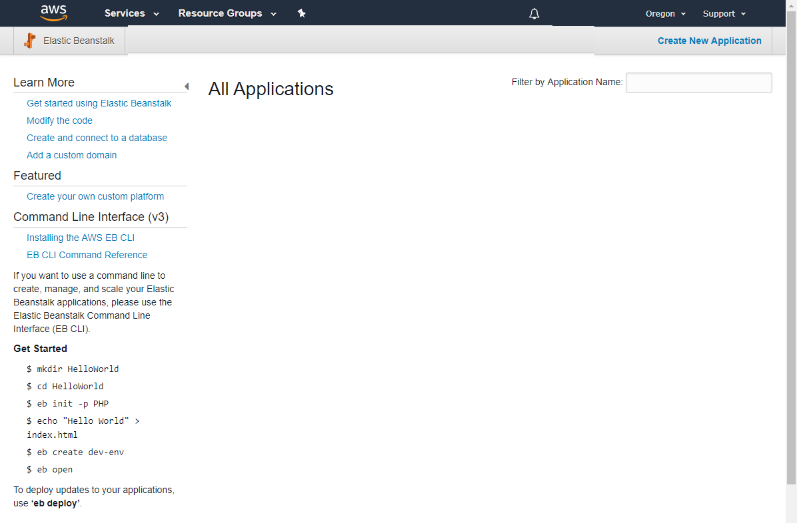

Then, click **Create New Application** at the top right.

Now, provide a **Name** for your application, such as ``MyApplication`` and a **Description**:

After adding all required tags, please click **Create**.

This will create what is - somewhat confusingly - called an **Elastic Beanstalk Application**. This is basically a container for your Elastic Beanstalk web servers (and/or worker services).

## Step 3. Create Elastic Beanstalk Environment

Then, let's go ahead and click **Create one now**. This will show a selection page where you can select the type of environment tier.

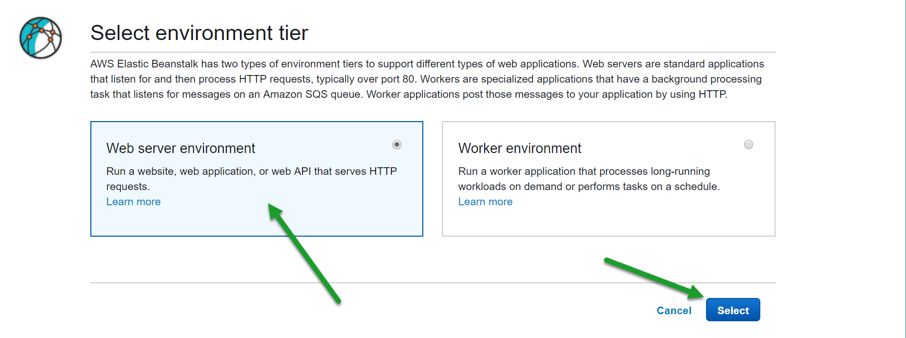

Select **Web server environment** and click **Select**.

### Environment Information

Then, as **environmentname** use the *lowercase* application name and add ``-env``:

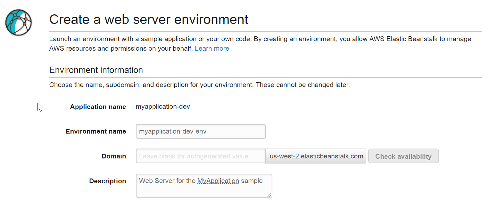

### Base Configuration

Then, scroll down, and then choose **Node.js** from the **Preconfigured platform** drop-down list:

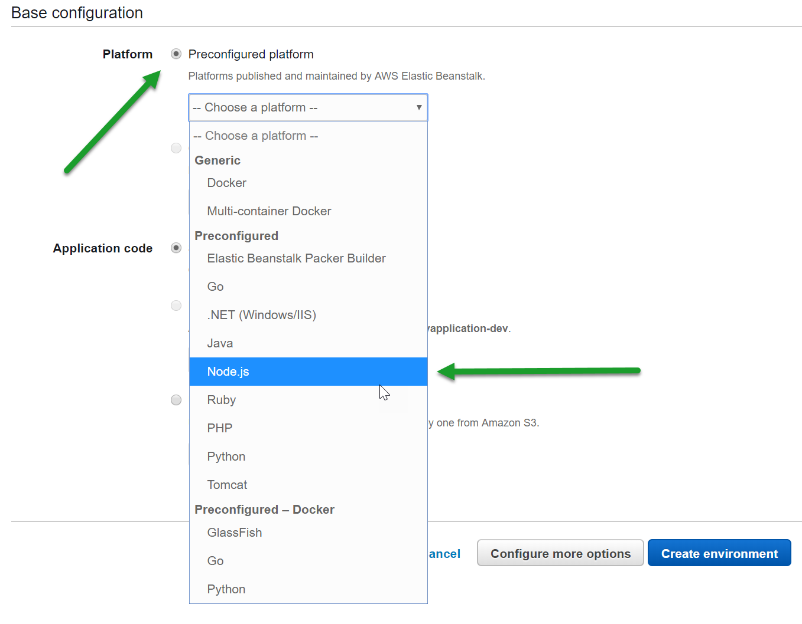

Then, select the **Upload your code** radio button and click **Upload**:

Now navigate to the ``2FirstDeploymentOfSampleWebsite.zip`` ZIP file you prepared earlier in this lab and select it, and click **Upload**

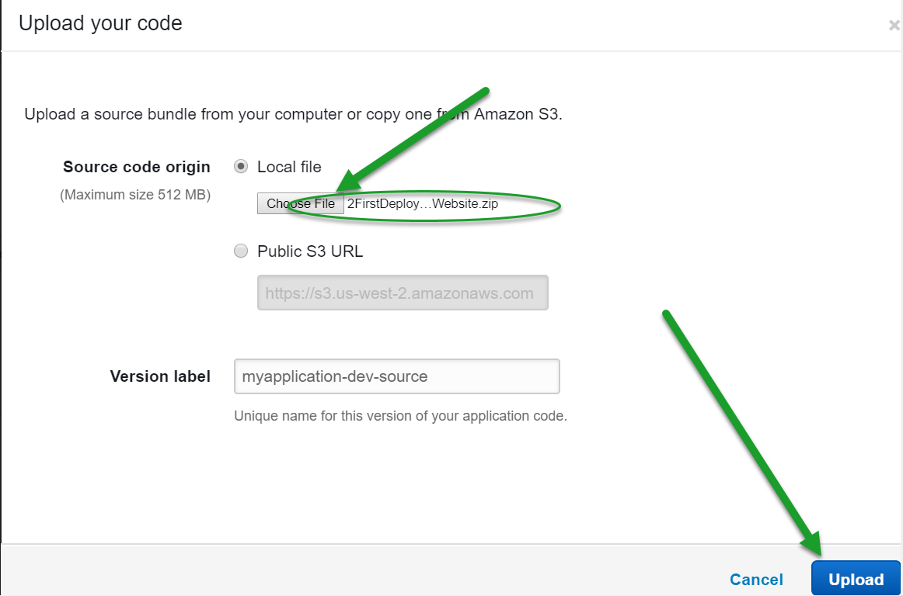

**Note:** Do **NOT** yet click on the blue button.

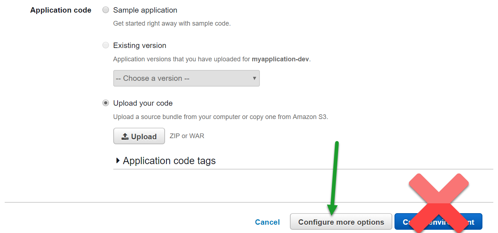

Let's click **Configure more options**.

### Configure More Options

After clicking **Configure more options** you will see a big page with 12 sections:

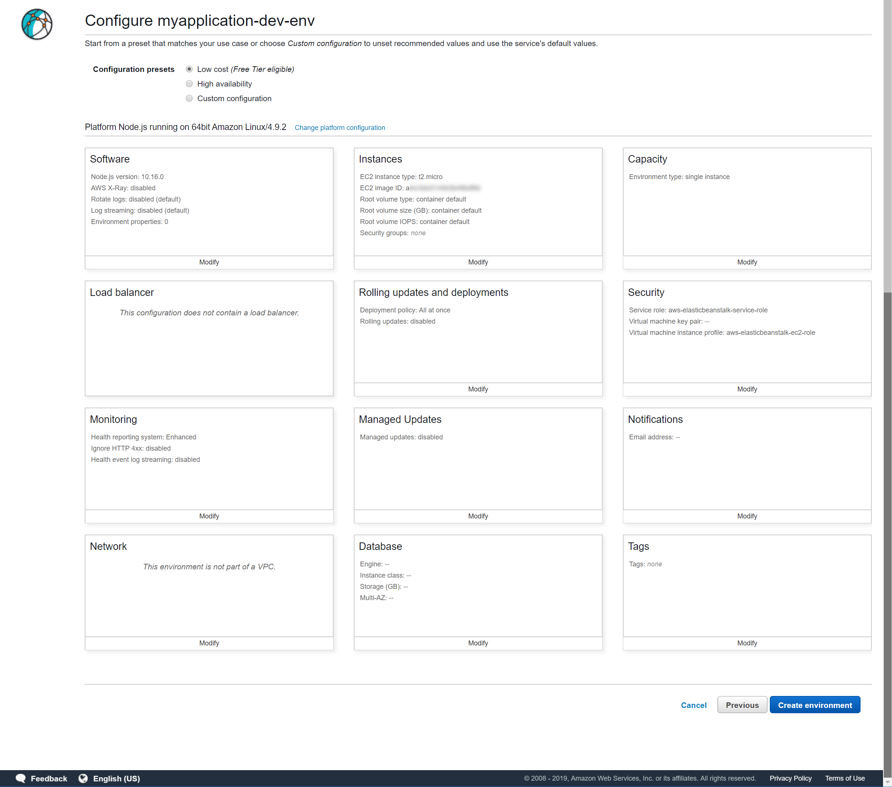

The next few steps have to be taken in the order mentioned to avoid issues with dependencies between the different sections, while configuring your application.

### Step 3.1. Instances

First, we will have to select a tiny instance for our web server. Let's go ahead and click **Modify** beneath the **Instances** section:

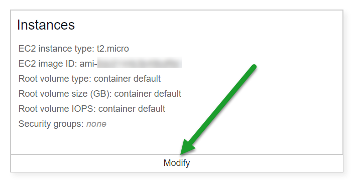

Then, select ``t3.nano`` from the **Instance type** drop-down list and click **Save**.

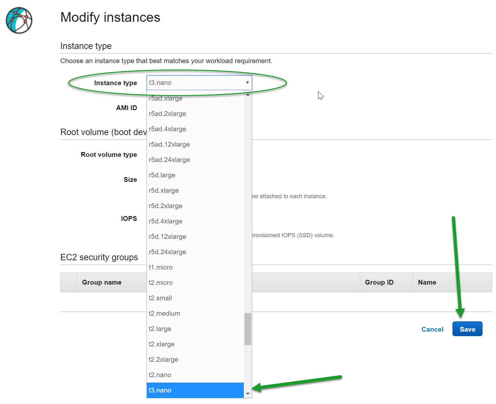

### Step 3.2. Capacity

Then, back on the big page with the 12 sections, click **Modify** beneath the **Capacity** section:

Select **Load balanced** from the **Environment type** drop-down list and click **Save**.

### Step 3.3 Security

Now, click **Modify** beneath the **Security** section:

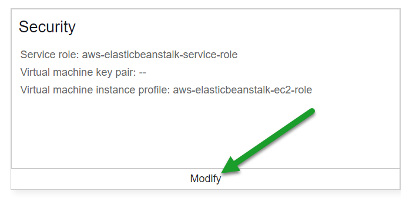

Note: if your organization has set up keypairs and an instance profile, please locate them in the **EC2 key pair** drop-down list, and select **SYA-EC2StagingProfile** from the **IAM instance profile** drop-down list. Otherwise just go ahead and create them. 

**Note:** Leave the **Service role** as-is.

### Step 3.4 Network

#### Step 3.4.1 VPC

If your organization uses a VPC, then scroll down on the page with the 12 sections and click **Modify** beneath the **Network** section.

Then select the desired VPC from the **VPC** drop-down list.

#### Step 3.4.2 Network Load Balancer Visibility

Then, select **Internal** from the **Visibility** drop-down list:

### Step 3.4.2. Network Load Balancer Subnets
 
Then, check every checkbox next to the **Private** subnets:

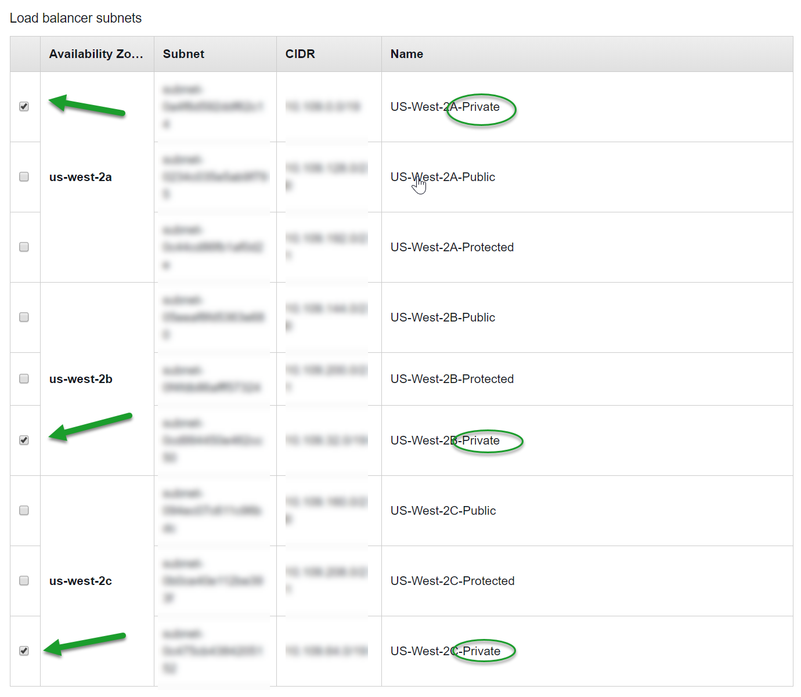

### Step 3.4.3. Instance Subnets

Then, also check every checkbox next to the **Private** subnets for the instances:

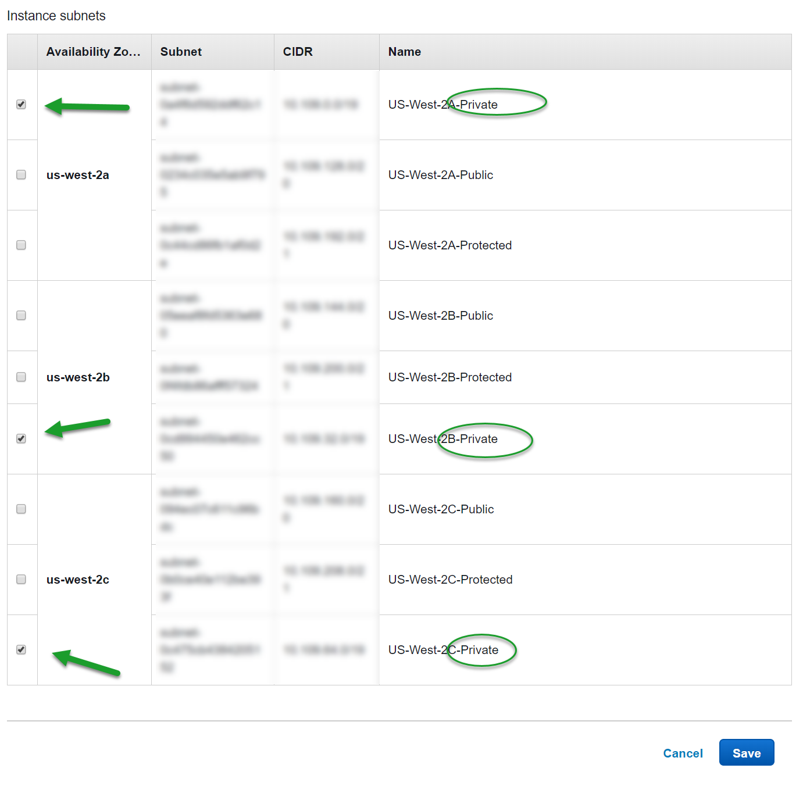

Now, click **Save**

### Step 4. Load balancer

Now, go to the section **Load balancer** and click **Modify** beneath it.

Then, change from **Classic Load Balancer** to **Application Load Balancer** by clicking on it.

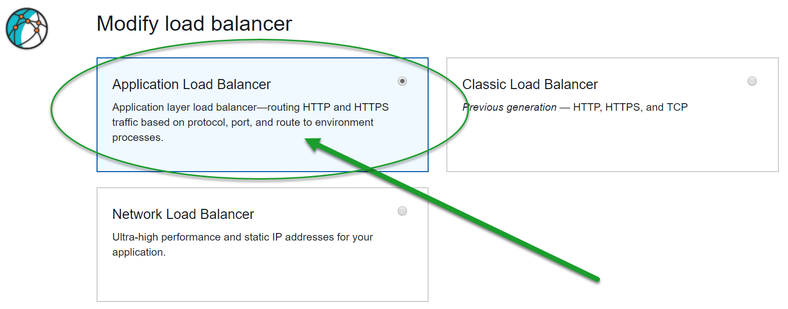

Now, scroll down and leave the rest as it is, for now and click **Save**.

### Step 5. Tags

Finally, we have to apply mandatory tags so the instances that will be created will conform to the AWS policies in place. This will avoid your instance failing to provision due to missing tags.

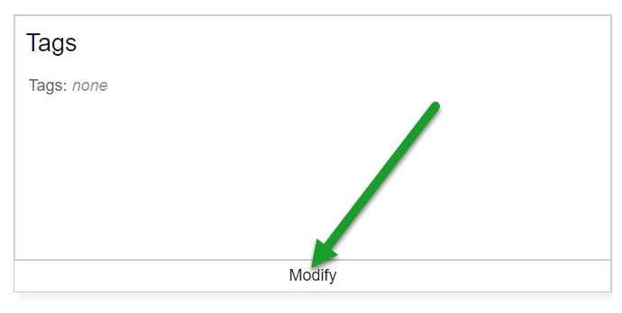

### Step 6. Create Environment

Now verify the values in all the sections, and click **Create new environment**

This process will take a few minutes and the output should look similar to this:

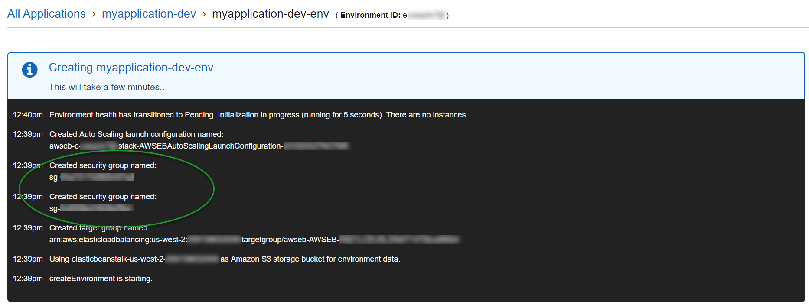

**Note:** If an error occured creating **Security groups** your account may be missing necessary permissions. Please contact the **DTPS** team to provide you with the correct permissions for **creating instances in Elastic Beanstalk**.

And after a while, you automatically land on the **Dashboard page** of your **Elastic Beanstalk** static hosted website:

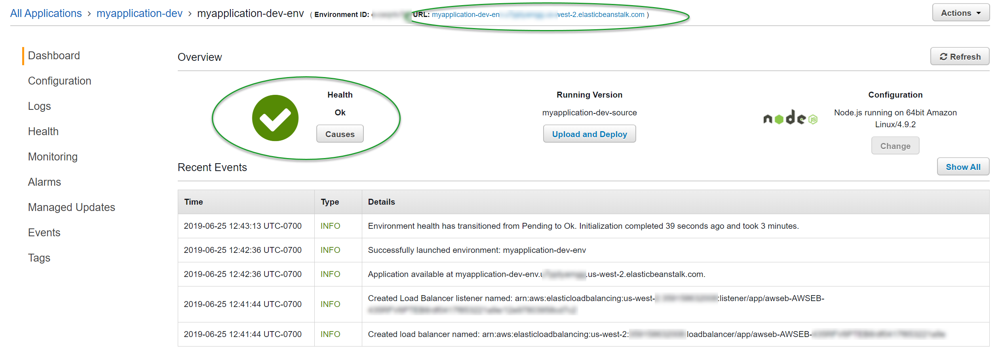

The URL to your website will be visible (and clickable) from the top of the **Dashboard** page.

For instance: [http://myapplication-dev-env.irut533ei.us-west-2.elasticbeanstalk.com](http://myapplication-dev-env.irut533ei.us-west-2.elasticbeanstalk.com)

## Congratulations: Elastic Beanstalk is running

And the output of the sample web application should look similar to this: 

## Secure your static hosted website

Now, as you may have noticed the sample web application is still running on port 80 and therefore not secure. We need to assign an SSL certificate to our Elastic Beanstalk Application Load Balancer to make our web application secure.

### Decide on a subdomain name

To host your web application inside your organization's internal network, we need to determine the unique sub-domain which we want to use for our application, for instance: 

*myapplication*.dev.yourcompanydomain.com

### Request an SSL certificate for your subdomain

Then request an SSL from your organization or create an SSL certificate in the AWS Certificate Manager console: [https://console.aws.amazon.com/acm/home](https://console.aws.amazon.com/acm/home) as well as request or create a subdomain for your application: [https://console.aws.amazon.com/route53/home](https://console.aws.amazon.com/route53/home)

You can use this template as body of the **What would you like to achieve?** request:

	Please create an SSL certificate for the sub domain name <myapplication>.yourcompanydomain.com  
	as well as a CNAME to my Elastic Beanstalk Application running at http://myapplication-dev-env.irut533ei.us-west-2.elasticbeanstalk.com
	
	Thanks!
	
### Wait for the issuance of the SSL certificate for your subdomain

Once your SSL certificate is issued, you will be able to see it in the **Load balancer** section of your **Configuration**:

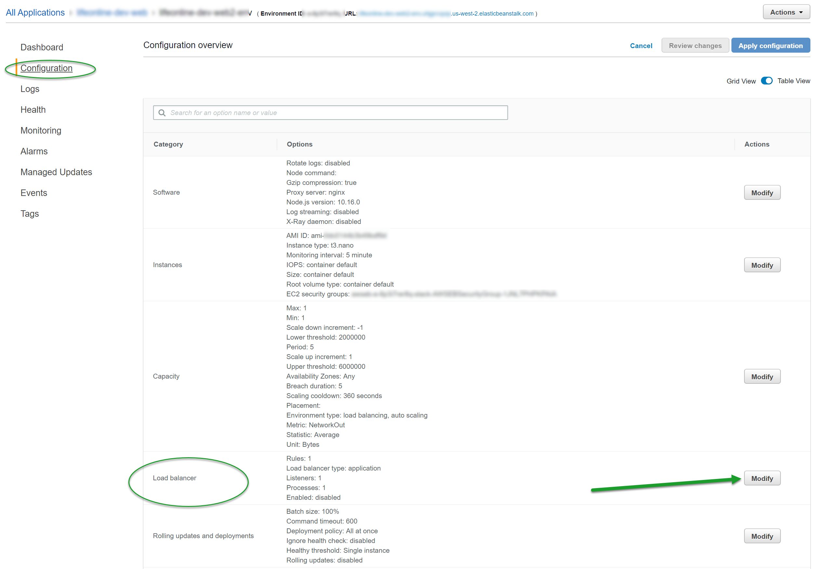

### Apply SSL certificate to your Application Load Balancer

Go to the **Configuration** page and click on **Modify** next to the **Load balancer** section.

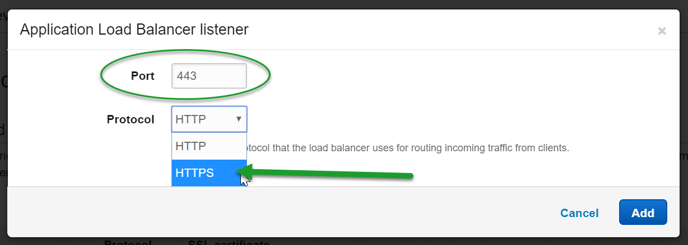 

Then, enter the value **443** for **Port** and select **HTTPS** from the **Protocol** drop down list.

This will open the **Security Settings** panel.

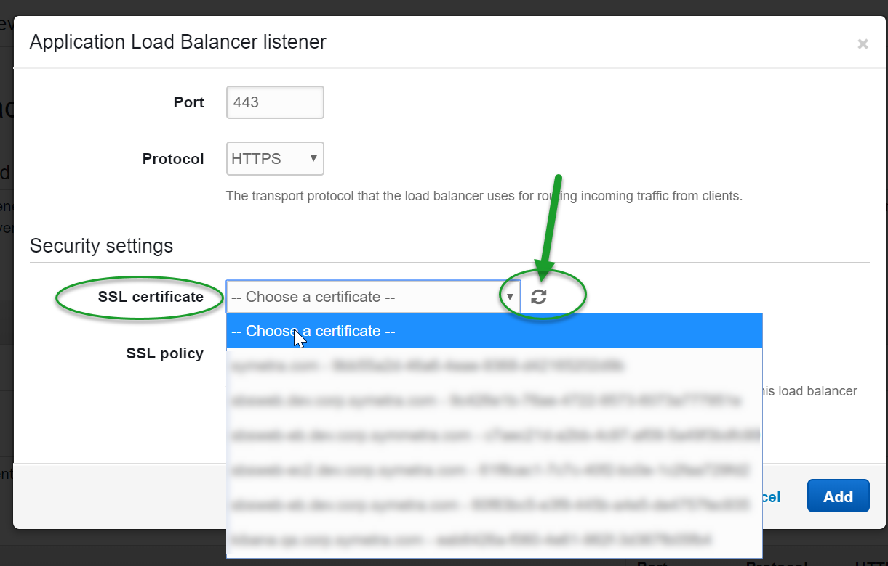

Then, locate your sub-domain name in the **SSL certificate** drop-down list. If you do not see your subdomain listed (yet), you can use the refresh icon to refresh the list. 

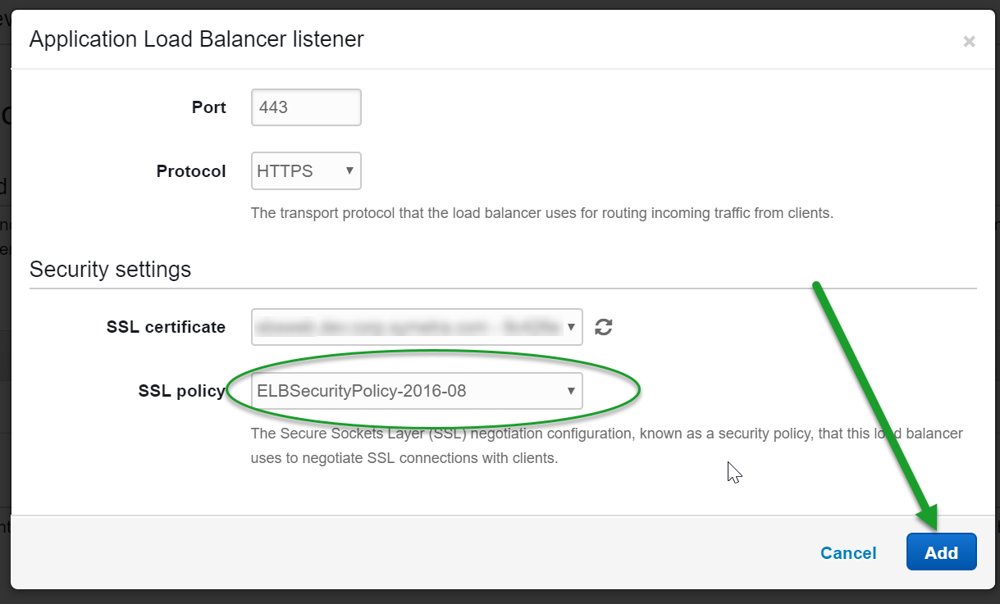

Then, for now, select **ELBSecurityPolicy-2016-08** from the **SSL policy** drop down list

Then, click **Add**.

You will see a new listener being added to the list.

Now, before we hit Apply we need to **turn off the listener on the non-SSL port 80**, as such:

Now, do not forget to scroll down and click **Apply**.

Then, after the environment is updated you can now access your web application with ``https://`` instead of ``http://``, for instance:

[https://myapplication-dev-env.irut533ei.us-west-2.elasticbeanstalk.com](https://myapplication-dev-env.u7pjdyamgg.us-west-2.elasticbeanstalk.com)

However, this URL will result in a **Privacy error**:

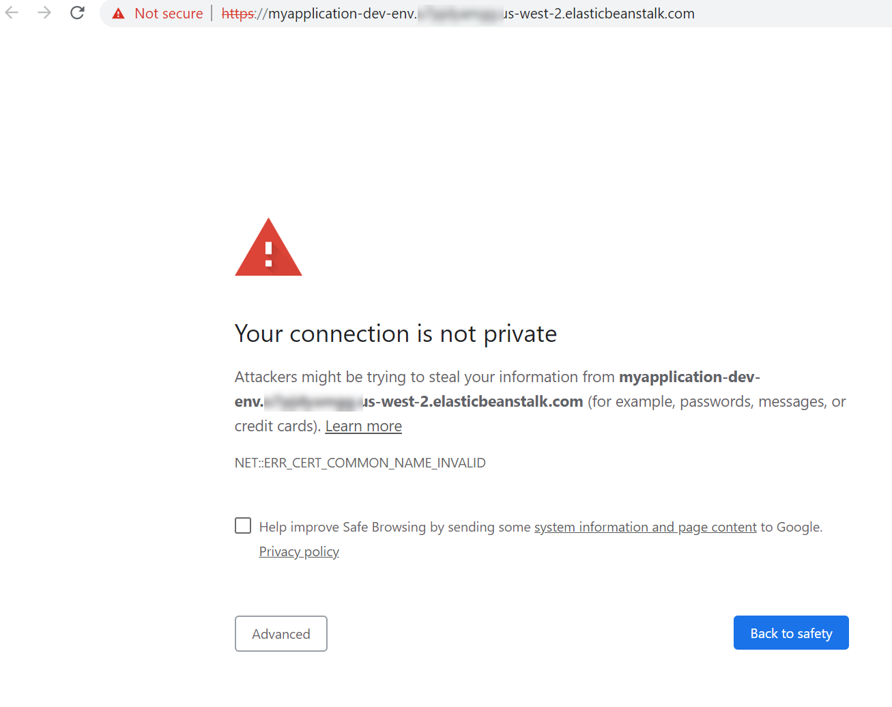

From now on, the requested sub domain URL needs to be used to access your website, for instance:

[https://myapplication.yourcompanydomain.com](https://myapplication.yourcompanydomain.com)

**Note:** it may take up to 24 hours before the DNS changes are propagated, so you may have to wait a little bit more before your domain URL becomes active.

## Conclusion

In this lab we guided you through the process of deploying a static hosted website to Elastic Beanstalk. 

## Contributors ##

| Roles											 | Author(s)										 |
| ---------------------------------------------- | ------------------------------------------------- |
| Lab Manuals									 | Manfred Wittenbols @mwittenbols					 |

## Version history ##

| Version | Date          		| Comments        |
| ------- | ------------------- | --------------- |
| 1.0     | June 25, 2019   | Initial release |

## Disclaimer ##
**THIS CODE IS PROVIDED *AS IS* WITHOUT WARRANTY OF ANY KIND, EITHER EXPRESS OR IMPLIED, INCLUDING ANY IMPLIED WARRANTIES OF FITNESS FOR A PARTICULAR PURPOSE, MERCHANTABILITY, OR NON-INFRINGEMENT.**
